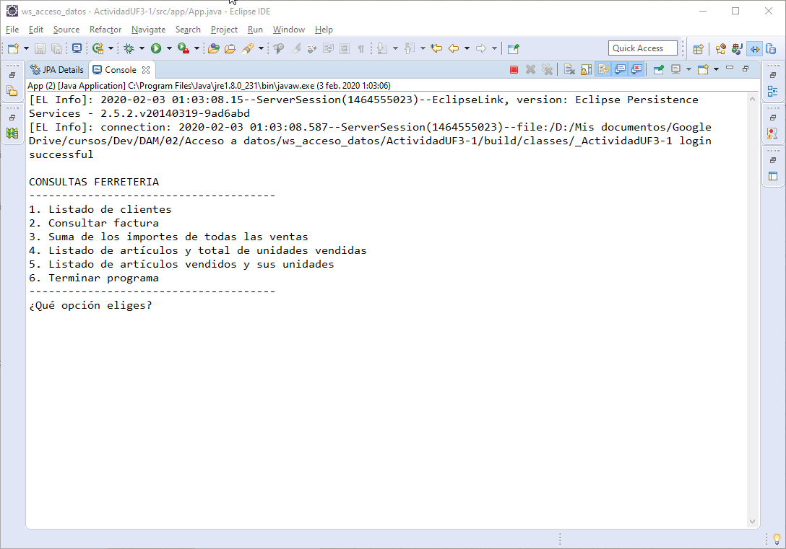
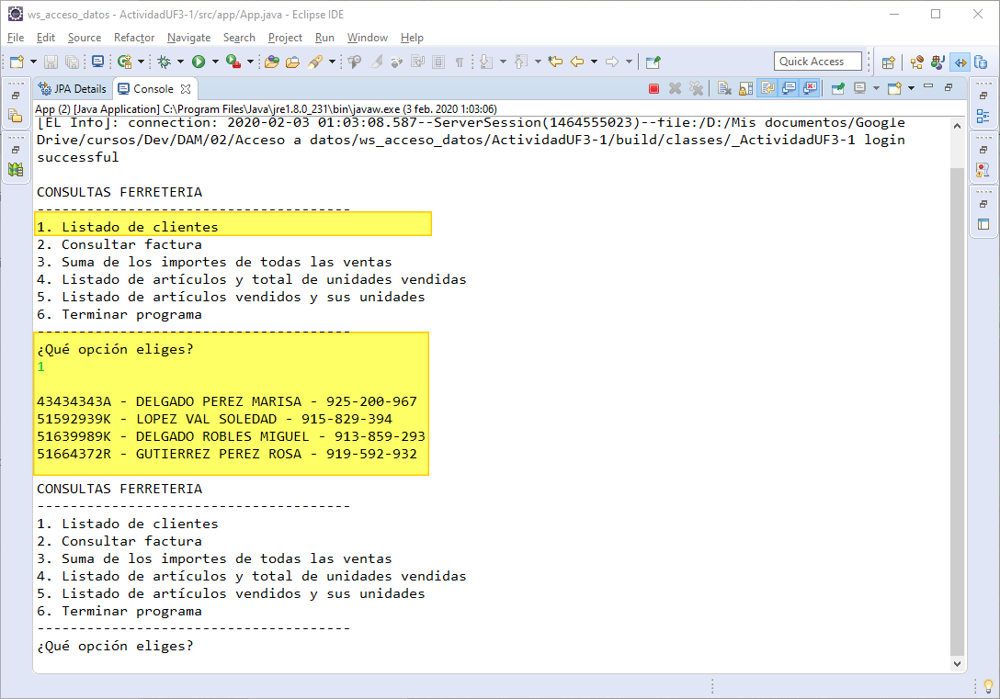
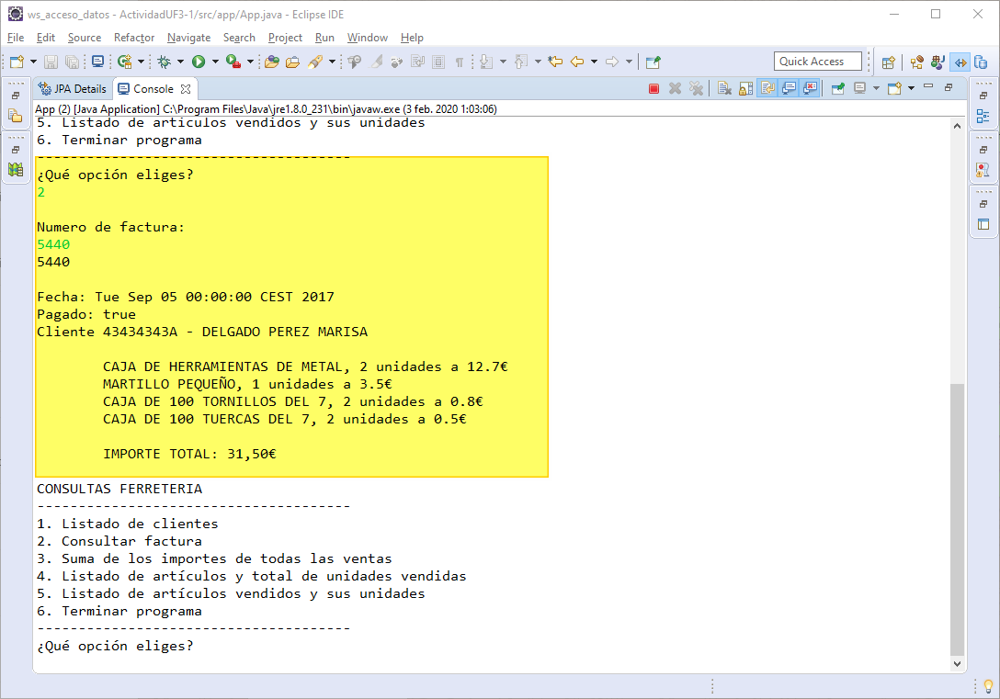
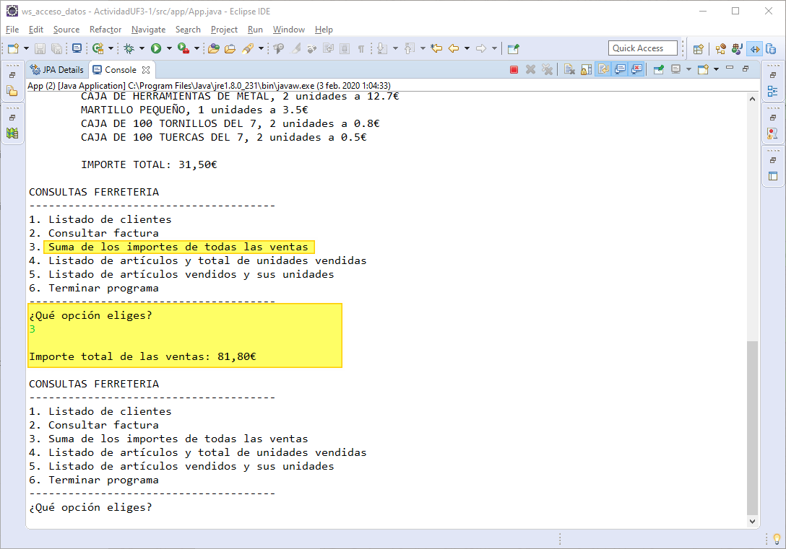
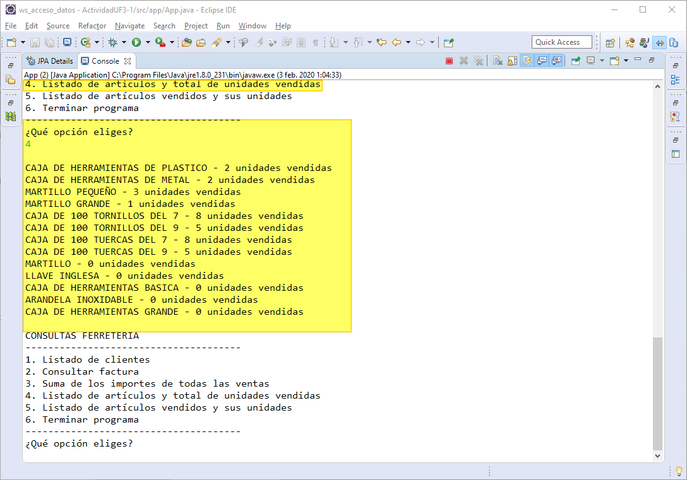
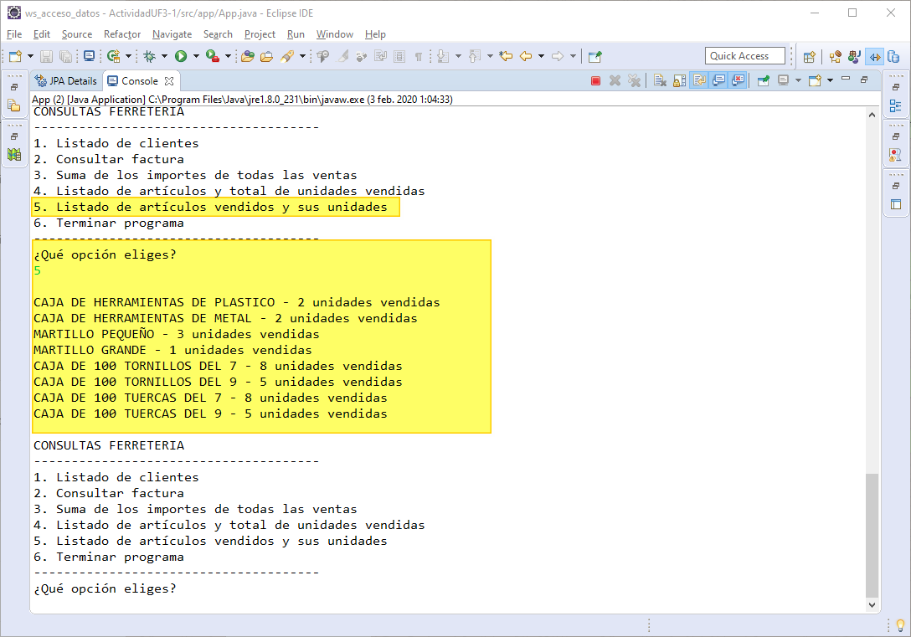

# Actividad UF3-1. Consultas FERRETERIA. 
Las clases realizadas se encuentran comentadas paso por paso. Algunos comentarios contienen la etiqueta `STUDY`, la cual utilizo junto con la extensión **To do Tree** de VS Code, para marcar donde debo repasar y estudiar, y asi acceder de una forma clara y directa en una lista de acciones que crea la extensión.

La tecnología utilizada `Java`, `JPA`, `EclipseLink`, `JPQL`, `EntityManagerFactory`, `EntityManager`, `Query`, `TypedQuery`. Como herramienta IDE/Editor **Eclipse**.

Capturas de resultados:

Juan Antonio Pavón Carmona.  
Programación de servicios y procesos.  
ITT DAM 2.
