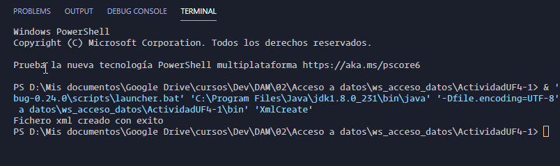
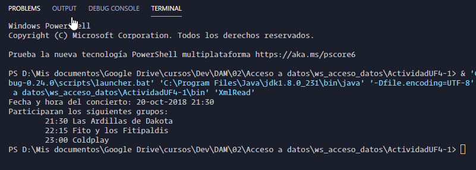

# Actividad UF4-1. Uso del parser DOM. 
Las clases realizadas se encuentran comentadas paso por paso. Algunos comentarios contienen la etiqueta `STUDY`, la cual utilizo junto con la extensión **To do Tree** de VS Code, para marcar donde debo repasar y estudiar, y asi acceder de una forma clara y directa en una lista de acciones que crea la extensión.

La tecnología utilizada `Java`, `DocumentBuilderFactory`, `DocumentBuilder`, `Document`, `Node`, `NodeList`, `TransformerFactory`, `Transformer`, `DOMSource`, `StreamResult`.

Como herramienta IDE/Editor **Vs Code**, con las siguientes extensiones:
- [Java Extension Pack](https://marketplace.visualstudio.com/items?itemName=vscjava.vscode-java-pack).
- [Todo Tree](https://marketplace.visualstudio.com/items?itemName=Gruntfuggly.todo-tree)
- [Markdown All in One](https://marketplace.visualstudio.com/items?itemName=yzhang.markdown-all-in-one).

Capturas de resultados:

`XmlCreate.java`

`XmlRead.java`

Juan Antonio Pavón Carmona.  
Programación de servicios y procesos.  
ITT DAM 2.
