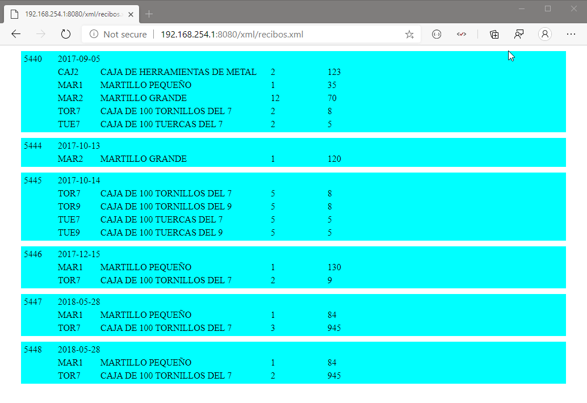
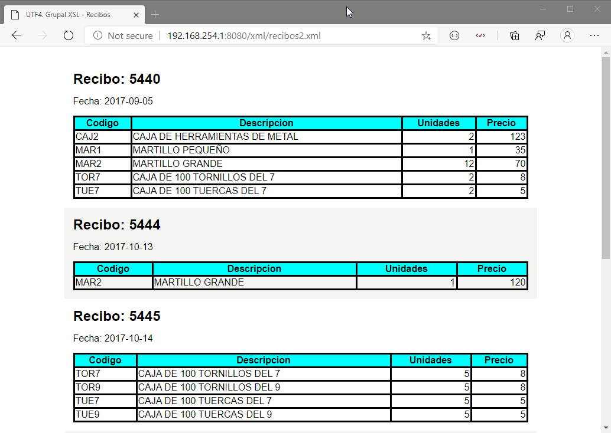

# Actividad UF4-Grupal. Base de datos XML FERRETERIA. 
Las clases realizadas se encuentran comentadas paso por paso. Algunos comentarios contienen la etiqueta `STUDY`, la cual utilizo junto con la extensión **To do Tree** de VS Code, para marcar donde debo repasar y estudiar, y asi acceder de una forma clara y directa en una lista de acciones que crea la extensión.

La tecnología utilizada `Java`, `XML`, `XSD`, `XLS`, `CSS`, `BaseX`, `Xquery`, `JDOM`. 

Grupo por: 
- Juan Antonio Pavón Carmona -> XML Y XLS
- Rubén Beltrán Muñoz -> JDOM
- Miguel Angel Nuñez López -> XSD 
- Cristian Sabal Mauro -> BaseX

Capturas de resultados:

**Juan Antonio Pavón Carmona -> XML Y XLS**

`xml/recibos.xml` -> validado `XSD`

`xml/recibos2.xml`

**Rubén Beltrán Muñoz**
