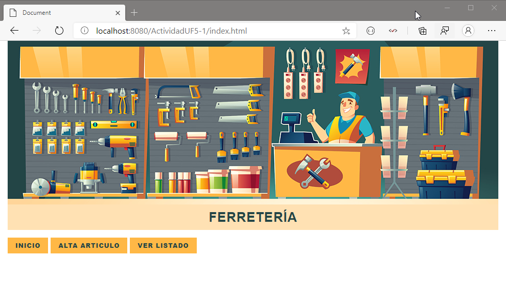
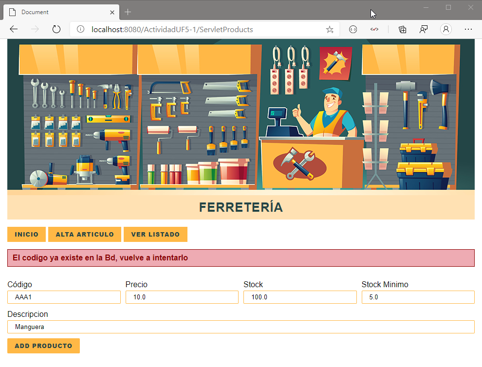
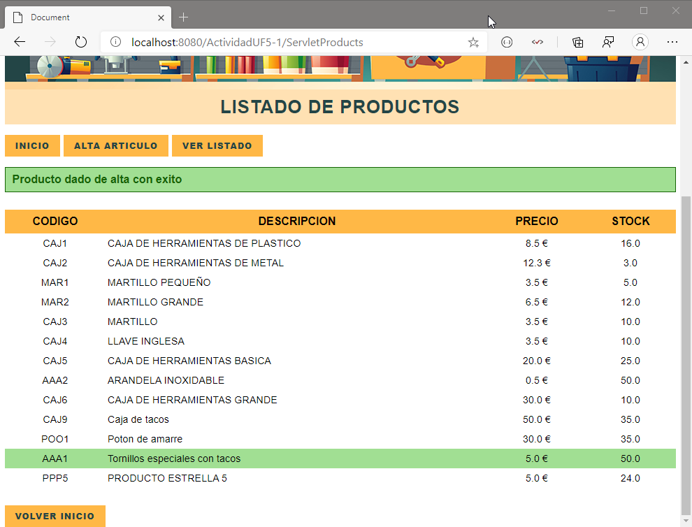
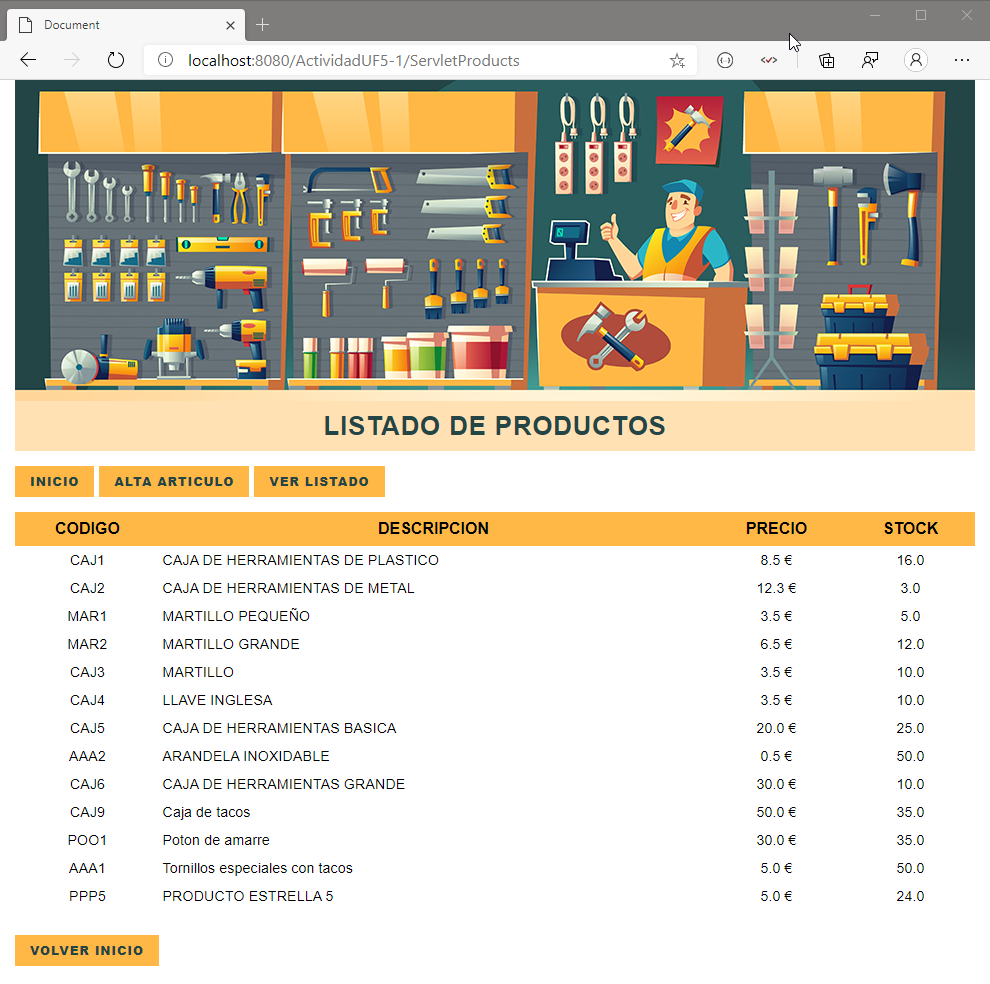

# Actividad UF5-1. Proyecto web catálogo de artículos. 

Proyecto web dinámico en Java de un catálogo de productos. Listado y Alta.

Las clases realizadas se encuentran comentadas paso por paso. Algunos comentarios contienen la etiqueta `STUDY`, la cual utilizo junto con la extensión **To do Tree** de VS Code, para marcar donde debo repasar y estudiar, y asi acceder de una forma clara y directa en una lista de acciones que crea la extensión.

La tecnología utilizada `Java`, `Maven`, `JPA`, `Web`, `JDBC`, `Servlet`, `MVC`, `JSP`, `HTML`, `CSS3`.

Como herramienta IDE/Editor **Vs Code**, con las siguientes extensiones:
- [Java Extension Pack](https://marketplace.visualstudio.com/items?itemName=vscjava.vscode-java-pack).
- [Todo Tree](https://marketplace.visualstudio.com/items?itemName=Gruntfuggly.todo-tree)
- [Markdown All in One](https://marketplace.visualstudio.com/items?itemName=yzhang.markdown-all-in-one).

Capturas de resultados:

`Inicio`

`Mensajes de Error`

`Mesaje de alta de producto`

`Lisado`

Juan Antonio Pavón Carmona.  
Programación de servicios y procesos.  
ITT DAM 2.
